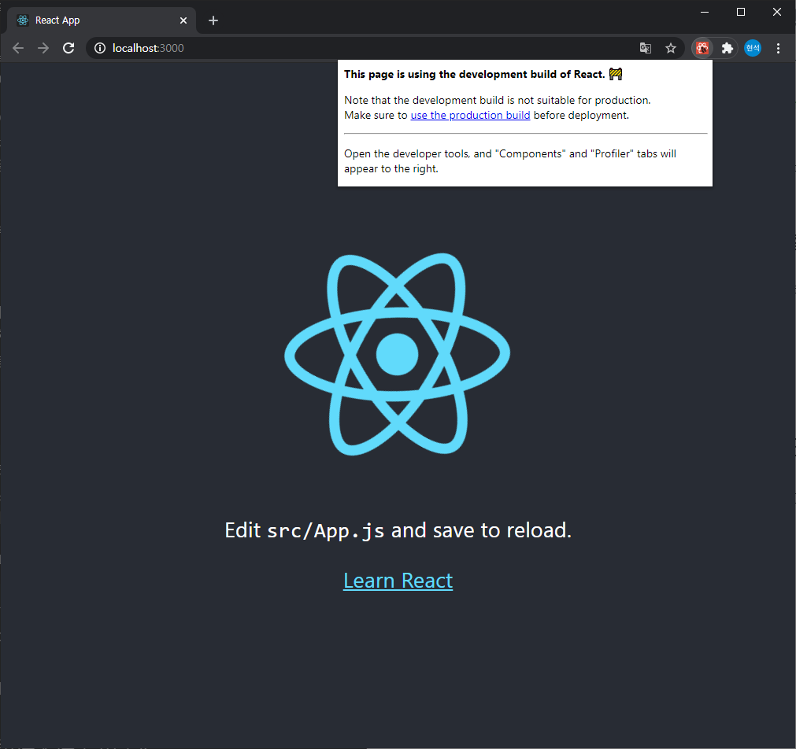

# React.js 셋업 및 시작
2021-02-16 Tuesday

오랜만에 재미난 코딩거리가 생각나서 리액트를 활용해 만들어보려 했다.

매일 두뇌를 깨우려 준비운동..? 격으로 하는 [Oh h1](https://0hh1.com/)라는 단순한 퍼즐 게임이다. 

한동안 다른 공부도 하고, 연초에는 하루바삐 노느라 리액트를 안 쓴지 꽤 되는 바람에 TIL에 다시 정리하게 되었다.

## 1. npm(+node.js), npx 설치

React.js와 이를 간단하게 세팅하고 사용할 수 있게 해주는 create-react-app를 사용하기 위해 node.js와 그 패키지 매니저인 npm이 필요하다.

```bash
apt-get install npm
```

## 2. node.js, npm 버전 체크 및 업그레이드

CRA를 사용하기 위해선 node.js의 버전이 xx.x.x 이상이어야 한다는 메세지를 마주쳤다.

다음 각각의 명령어로 현재 버전을 확인할 수 있다.

```
node -v
npm -v
``` 

### Node.js 업그레이드

node.js의 최신 버전은 n 패키지를 통해 설치할 수 있기 때문에 n 패키지를 설치했다.

```
npm install -g n
```

```n lts``` 명령어를 통해 가장 최신 LTS 버전으로 업그레이드 할 수 있고,

```n stable``` 명령어를 통해 가장 최신의 안정된 버전으로 업그레이드 할 수 있다.

```n x.x.x``` 명령어를 통해 특정 버전의 node.js를 설치할 수도 있다.

### npm 업그레이드

npm은 자가 ~~수리~~업그레이드가 가능하다.

```
npm install -g npm
```

## 3. react-create-app 설치, react 앱 생성

요즘엔 create-react-app 이라는 아주아주아주 편리한 라이브러리를 주로 사용하지만, 원래 react는 Babel, Webpack 등의 도구들을 통해 개발환경을 설정해야하는 어려움이 있었다고 한다.

지금 당장은 간단하게 CRA를 쓸 것이다.

```
npm install -g create-react-app
```

CRA를 설치했다면, create-react-app 명령어를 사용할 수 있다.

```bash
create-react-app {앱 이름}
```

이로써 react를 사용 할 수 있는 환경이 마련되었다! 




---

상세하게 파고들면 이보다 다양한 옵션이 매우 많지만, 일단은 간단하게 정리해봤다.